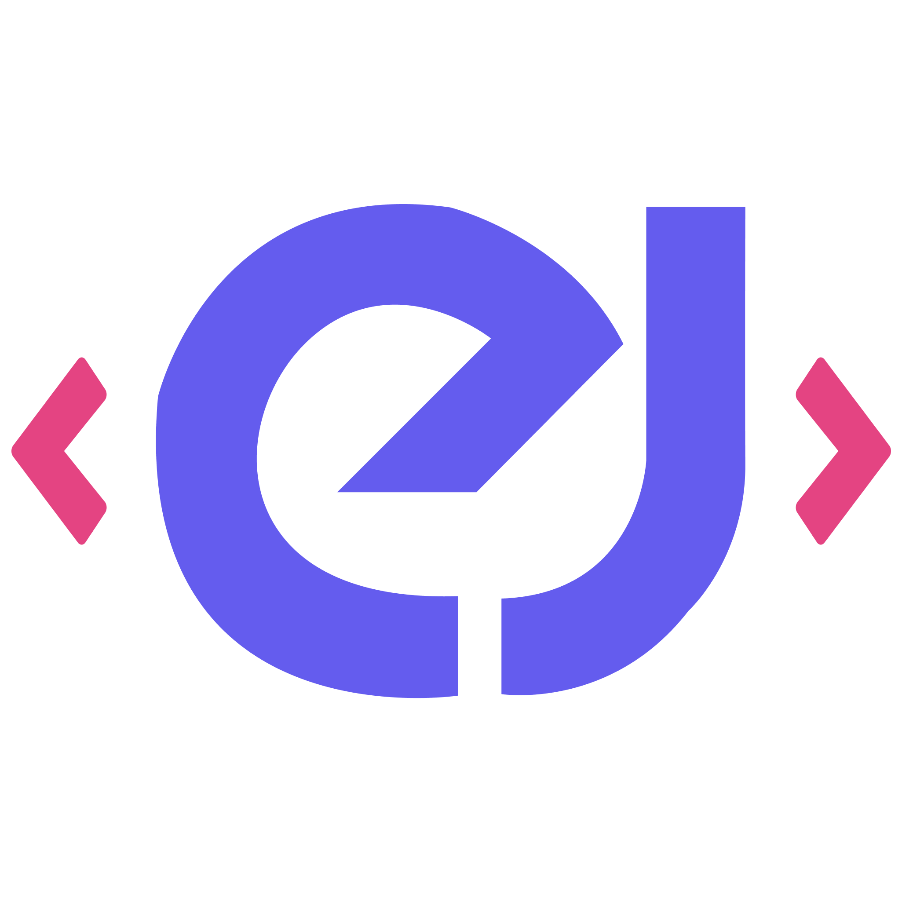
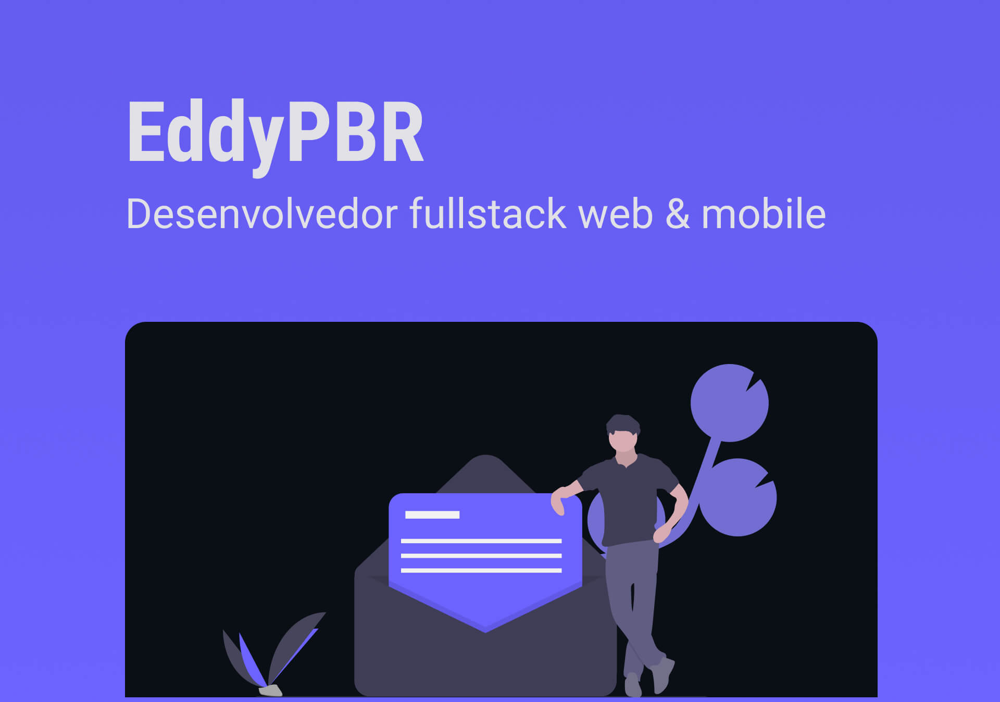
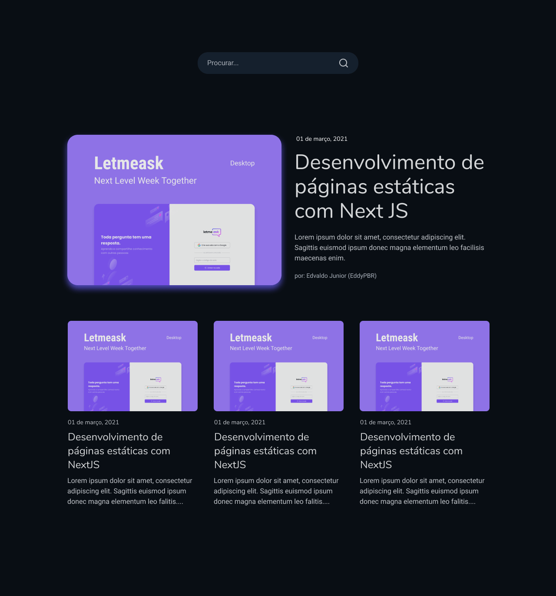
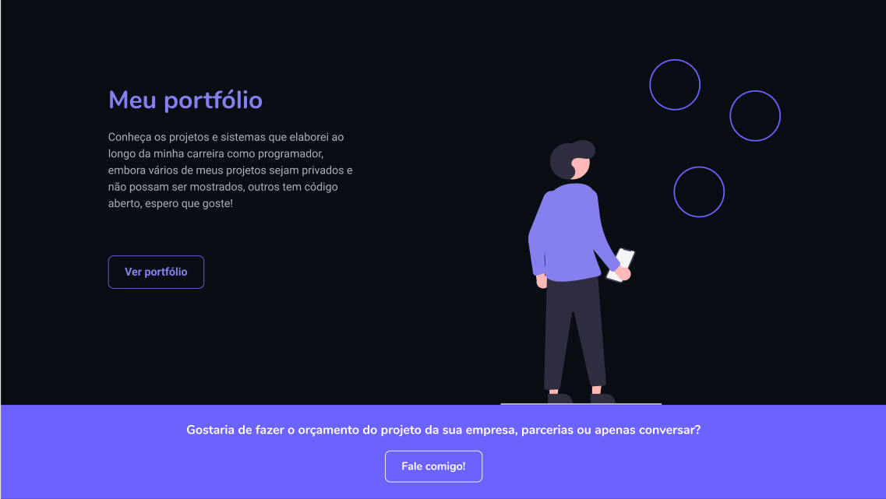

<h1 align="center">
  
   
  NextJS | Typescript | Styled-components | Vercel
</h1>

 

  
  
  

 

## :bookmark: Resumo

Este projeto consiste em meu website pessoal para promover meus trabalhos/portfólio, compartilhar
conhecimento e dicas com os desenvolvedores em formação em um blog, e ainda mostrar o feedback
dos profissionais e clientes que trabalharam comigo durante minha carreira.

É Algo simples, porém desenvolvido com muito amor e carinho, este projeto foi criado por mim
desde o seu design até os códigos e deploy, para acessar o meu website e projeto
[clique aqui](https://eddypbr-website.vercel.app/) espero que goste!

 

## :bulb: Tecnologias utilizadas

- NextJS
- React
- Styled-components
- Google SMTP
- Variáveis ambiente
- Deploy na Vercel
- Figma

 

## :eyes: Design e Preview

O design é simplório, mas objetivo e claro quanto aos destaques das informações e dados que quero transmitir. 
Criado na plataforma Figma o design pode ser encontrato no 
[Link do Protótipo](https://www.figma.com/file/c3YK8lGD7f62rEH0UAHc2A/personal-website?node-id=0%3A1)
espero que goste!

Aqui estão alguns previews do website:

 

 

 

 

 

## :wrench: Colocando o projeto para rodar

Para colocar o projeto para rodar, basta seguir o passo a passo fornecido logo abaixo:

- 1º: Tenha o NODE instalado na sua máquina;
- 2º: Faça o download deste projeto;
- 3º: Com o terminal/prompt abra o diretório deste projeto e execute o comando `npm run` ou `yarn`;
- 4º: Crie um arquivo `.env.local` no diretório raiz do projeto;
- 5º: Copie as variaveis do arquivo `.env.example` e cole no `.env.local`, agora preencha as informações com os dados correspondentes `passo 4`;
- 7º: Após tudo finalizado, agora execute o comando `npm run dev` ou `yarn dev`;
- 8º: Pronto tudo configurado e rodando, faça bom proveito;

 

## :memo: License

Este projeto esta sob a [MIT license](LICENSE) para mais detalhes.

 

## :wave: Social

Siga @eddypbr nas redes :wink:

- [Instagram](https://www.instagram.com/eddy_pbr/)
- [LinkedIn](https://www.linkedin.com/in/eddypbr/)
- [Facebook](https://www.facebook.com/eddypbr/)
- [Website](https://eddypbr-website.vercel.app/)
